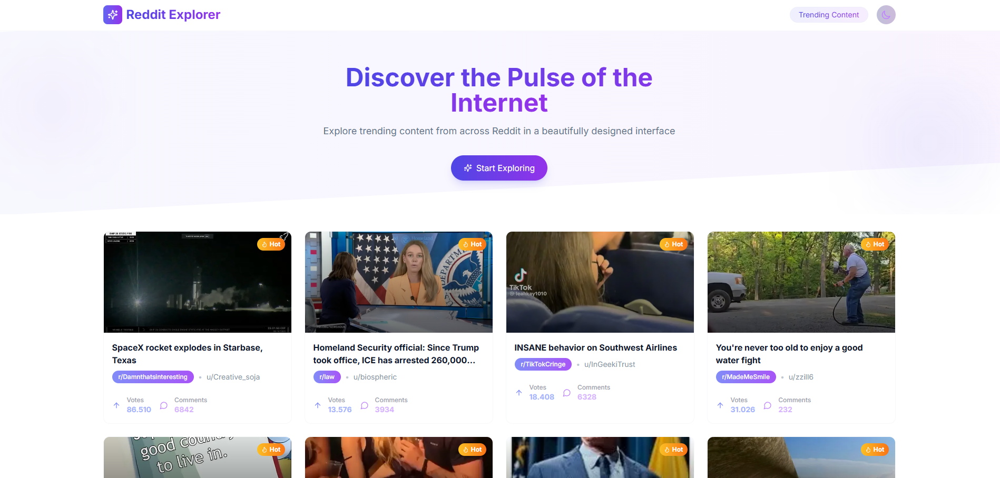

# Reddit Explorer 🚀

[](https://vercel.com/new/clone?repository-url=https%3A%2F%2Fgithub.com%2Fcrestrepo27%2Freddit-landing)

Reddit Explorer es una landing page moderna que muestra contenido popular de Reddit con un diseño atractivo, animaciones fluidas y modo oscuro. Consume la API pública de Reddit para mostrar posts, implementa scroll infinito y ofrece una experiencia de usuario altamente interactiva.



## Características ✨

- **Diseño moderno y responsive**: Interfaz limpia y atractiva que funciona en móviles y escritorio.

- **Modo oscuro/claro**: Cambia entre temas según tus preferencias.

- **Scroll infinito**: Carga automática de posts al llegar al final de la página.

- **Animaciones fluidas**: Con Framer Motion para transiciones suaves y efectos de hover.

- **Indicadores visuales**:

- Esqueletos de carga (skeleton) durante la carga de datos.

- Confeti cuando se llega al final de los posts.

- **Optimizado para rendimiento**: Uso de Next.js Image Component y lazy loading.

- **Paginación inteligente**: Carga hasta 150 posts con límite de 50 por petición.

## Tecnologías 🛠️

- **Next.js 14**: Framework React para renderizado estático y dinámico.

- **Tailwind CSS**: Utilizado con plugins para gradientes y animaciones.

- **Framer Motion**: Biblioteca para animaciones avanzadas.

- **TypeScript**: Tipado estático para mayor seguridad en el código.

- **Axios**: Cliente HTTP para consumir la API de Reddit.

- **Canvas Confetti**: Para efectos de confeti al completar la carga.

- **React Icons (Lucide)**: Iconos modernos y elegantes.

## Configuración ⚙️

### Requisitos previos

- Node.js v18+

- npm v9+

### Instalación

1. Clonar el repositorio:

```bash

git clone https://github.com/crestrepo27/reddit-landing.git

cd reddit-landing

```

2. Instalar dependencias:

```bash

npm install

```

3. Ejecutar en modo desarrollo:

```bash

npm run dev

```

4. Abrir en el navegador:

```

http://localhost:3000

```

### Despliegue

[](https://vercel.com/new/clone?repository-url=https%3A%2F%2Fgithub.com%2Fcrestrepo27%2Freddit-landing)

También puedes desplegar en Vercel vinculando tu repositorio GitHub.

## Estructura de Carpetas 📁

```

src/

├── app/

│   ├── components/

│   │   └── ui/       # Componentes UI reutilizables

│   ├── hooks/        # Custom hooks

│   ├── lib/          # Lógica de servicios y API

│   ├── styles/       # Estilos globales

│   ├── layout.tsx

│   └── page.tsx

└── types/            # Tipos TypeScript

public/               # Assets estáticos
